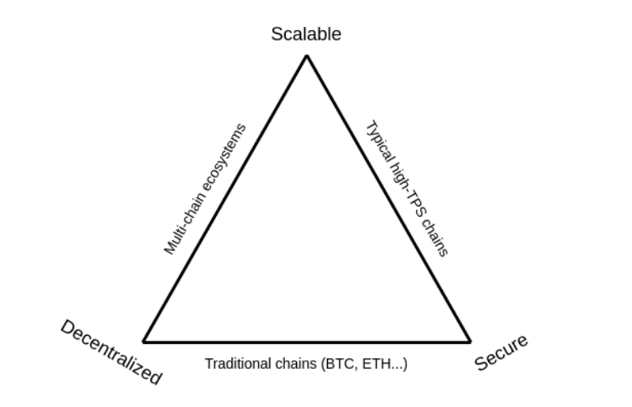
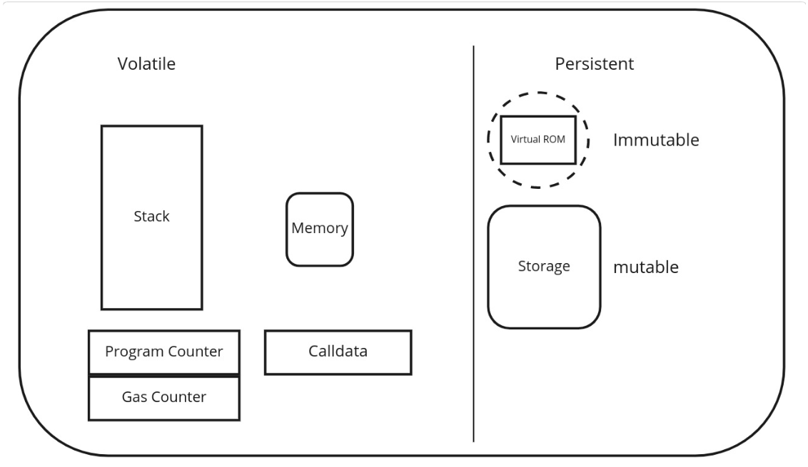
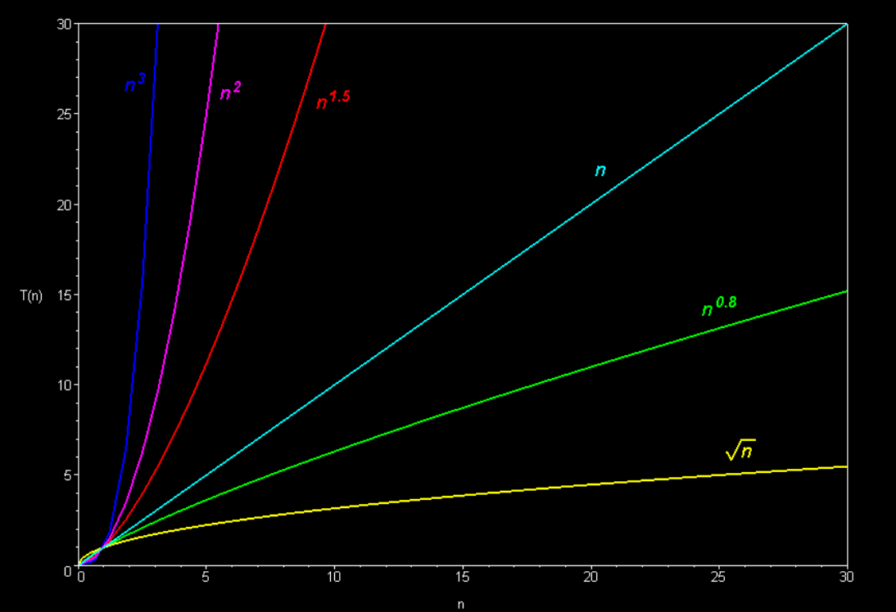
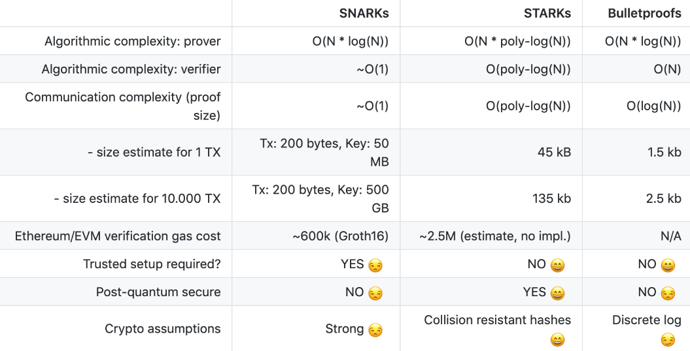
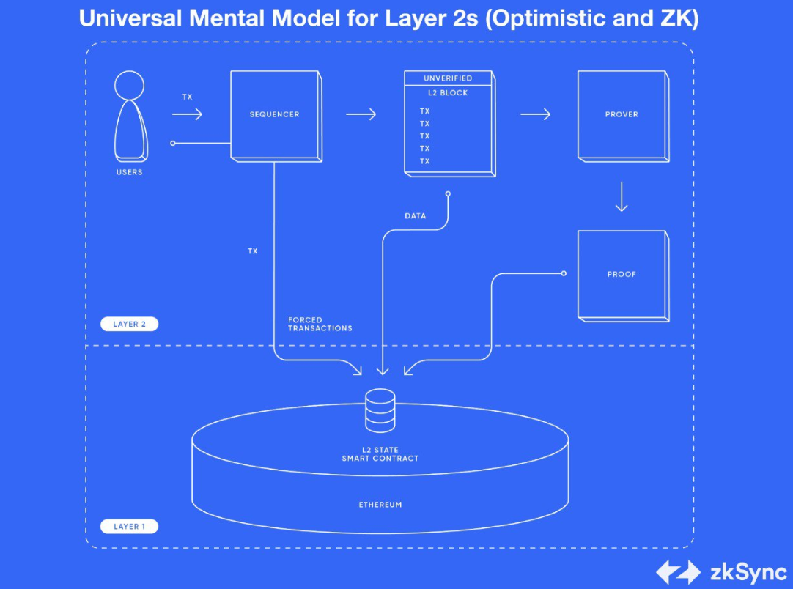
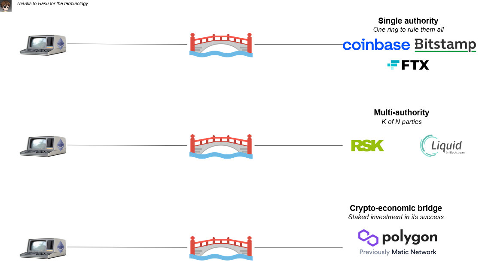
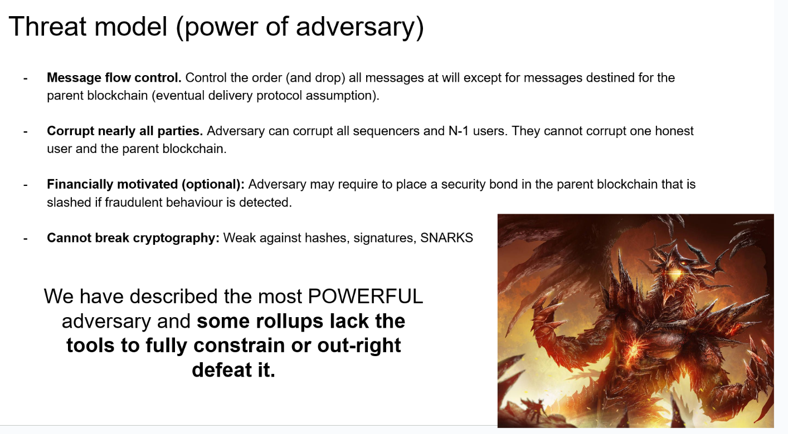
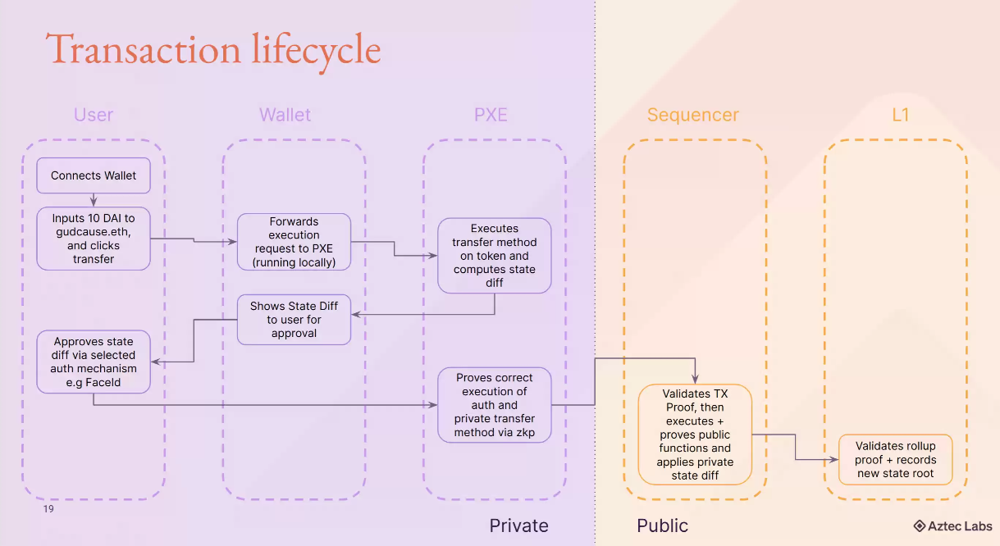
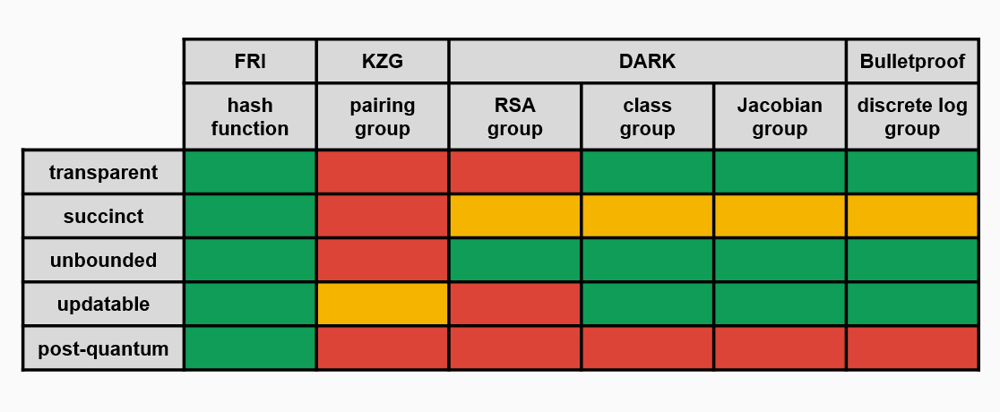
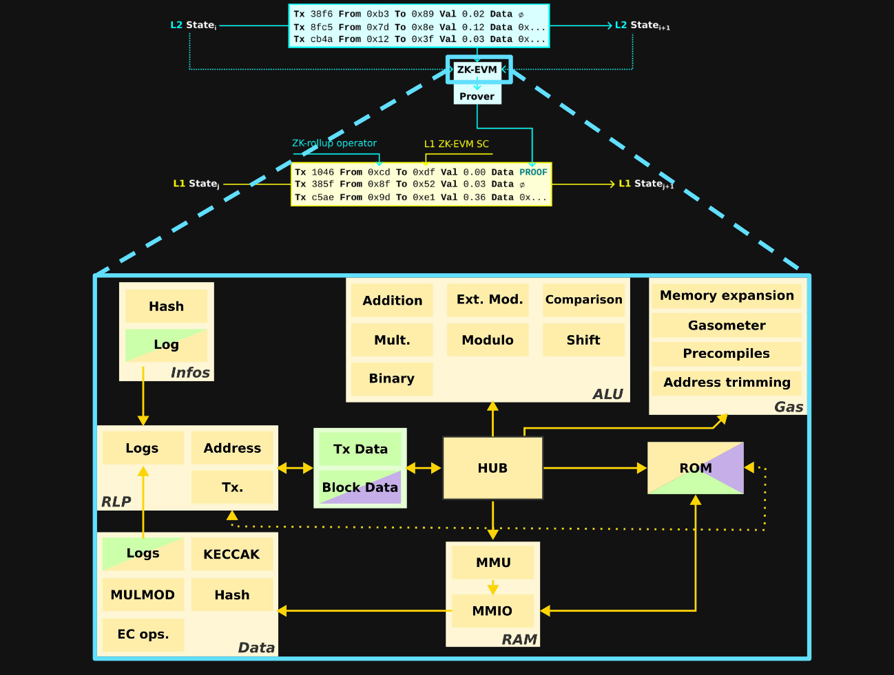

# [zkEVM Bootcamp](https://www.encode.club/zksync-zkevm-bootcamp)
This repo contains my solutions to the homework assigned in the bootcamp and notes.

- [zkEVM Bootcamp](#zkevm-bootcamp)
  - [Day 1](#day-1)
    - [The introduction](#the-introduction)
  - [Day 2](#day-2)
    - [Why scalability](#why-scalability)
  - [Day 3](#day-3)
    - [Introduction to L2](#introduction-to-l2)
      - [Data availability (DA)](#data-availability-da)
      - [Hash functions](#hash-functions)
      - [Numbers and terminology](#numbers-and-terminology)
  - [Day 4](#day-4)
    - [Math and Cryptography](#math-and-cryptography)
      - [Zero Knowledge Proof](#zero-knowledge-proof)
  - [Day 5](#day-5)
    - [Rust](#rust)
    - [Understanding and Analyzing Layer 2](#understanding-and-analyzing-layer-2)
  - [Day 6](#day-6)
    - [Agnostic Layer 2 Transaction Lifecycle](#agnostic-layer-2-transaction-lifecycle)
  - [Day 7](#day-7)
    - [Presentation by Patrick McCorry](#presentation-by-patrick-mccorry)
  - [Day 8](#day-8)
    - [SNARK overview](#snark-overview)
  - [Day 9](#day-9)
    - [What's next in L2, part 2: L3s/Hyperchains](#whats-next-in-l2-part-2-l3shyperchains)
      - [ZoKrates](#zokrates)
      - [How L3 can be useful](#how-l3-can-be-useful)
      - [Interoperability of L2s](#interoperability-of-l2s)
      - [Proofs aggregation](#proofs-aggregation)
  - [Day 10](#day-10)
    - [Privacy in Layer 2 and presentation by Josh Crites from Aztec!](#privacy-in-layer-2-and-presentation-by-josh-crites-from-aztec)
  - [Day 11](#day-11)
    - [What are ZK EVMs, part 1: Overview](#what-are-zk-evms-part-1-overview)
  - [Day 12](#day-12)
    - [What are ZK EVMs, part 2: Universal circuits/circuit compiler](#what-are-zk-evms-part-2-universal-circuitscircuit-compiler)
      - [Gates](#gates)
      - [Lookup tables and Custom gates](#lookup-tables-and-custom-gates)
      - [Underconstrained code](#underconstrained-code)
  - [Day 13](#day-13)
    - [What are ZK EVMs, part 3: Proving systems](#what-are-zk-evms-part-3-proving-systems)
      - [Polynomial Commitment Schemes](#polynomial-commitment-schemes)
      - [Interactive Oracle Proofs](#interactive-oracle-proofs)
  - [Day 14](#day-14)
    - [Presentation by Porter Adams](#presentation-by-porter-adams)
  - [Day 15](#day-15)
    - [Overview of Proving Systems](#overview-of-proving-systems)
      - [Halo 2](#halo-2)
      - [Mina](#mina)
  - [Day 16](#day-16)
    - [SNARK implementation](#snark-implementation)
      - [Polynomial checking](#polynomial-checking)
      - [Trace tables](#trace-tables)
      - [Fiat-Shamir heuristic](#fiat-shamir-heuristic)
  - [Day 17](#day-17)
    - [STARK implementation](#stark-implementation)
      - [Computation integrity](#computation-integrity)
      - [Reed-Solomon error correction](#reed-solomon-error-correction)
      - [FRI (Fast Reed-Solomon IOP of Proximity)](#fri-fast-reed-solomon-iop-of-proximity)
    - [Presentation by Henri Lieutaud from Starknet](#presentation-by-henri-lieutaud-from-starknet)
  - [Day 18](#day-18)
    - [Plonk, part 1: Linea](#plonk-part-1-linea)
    - [Presentation by Emily and Alexandre from Linea](#presentation-by-emily-and-alexandre-from-linea)
  - [Day 19](#day-19)
    - [Plonk, part 2: Boojum](#plonk-part-2-boojum)
      - [Customizable Constraint Systems](#customizable-constraint-systems)
      - [Plonky2](#plonky2)
      - [Presentation of Boojum by Oles Holembovskyy from zkSync](#presentation-of-boojum-by-oles-holembovskyy-from-zksync)
        - [Copy-permutation arguments](#copy-permutation-arguments)
        - [Gates](#gates-1)
        - [Lookup columns](#lookup-columns)
        - [Boojum Gadgets](#boojum-gadgets)


## Day 1
### The introduction
There were several speakers from Encode, zkSync, and Extropy. The interesting parts for me were:
1. A structured overview of the problems that crypto and blockchain solve:
- inflation
- availability of money
- crises
- centralization
- etc.
2. Detailed insights into the history of consensus mechanisms and the development of the Merge. 
We also quickly covered cryptographic basics such as the Diffie-Hellman key exchange protocol and Merkle trees.

## Day 2
### Why scalability
Laurence from Entropy made some key points about Layer 1 solutions:
- History of the classic scalability problem. This is the main problem that various L1 and L2 blockchains are trying to solve: having scalability, decentralization and security at the same time.

- TPS measures and marketing. Context is important when you see advertised parameters like TPS, because they vary widely in different contexts and may not be achievable in reality.
- Popular blockchains like Ethereum and Bitcoin are much slower than traditional payment systems like Visa. While it is a fact, I think blockchains theoretically have more potential than traditional systems because they have more computing power.
- Sequential and parallel transaction processing. The simplified systems with sequential ordering of transactions like Ethereum introduce problems like MEV and poor horizontal scaling. Parallel processing can solve them, but it is much more complex.
- [Sharding in Ethereum](https://vitalik.ca/general/2021/04/07/sharding.html).
- The main limitations of the TPS are CPU, bandwidth, and memory.

Layer 2 solutions can be done with different approaches:
- Plasma
- State Channels (The Lightning Network on Bitcoin)
- Sidechains
- Hybrids
- Validium
- Rollups
    - ZKP Rollups
    - Optimistic Rollups

Rollups are the most popular at the moment. They currently have some problems, such as centralized or restricted Sequencers.
ZKP rollups and optimistic rollups differ in the process of batch validation. By default, ZKP rollups don't trust any data sent to the Verifier on L1. Optimistic rollups accept all data by default, but fraud can be detected.

It's interesting how many ZKP rollups have the "ZK" part in their name, but don't actually use it. I remember videos I saw on YouTube explaining the difference between SNARKs and zk-SNARKs, and these rollups can use the primer because there's really no point in "zero-knowledge" privacy at this stage. It is just important to have a succinct proof.

Vitalik Buterin recently wrote [a very interesting article](https://vitalik.eth.limo/general/2023/11/14/neoplasma.html) about the return of Plasma L2 in light of recent improvements in our understanding of zk-proofs.

## Day 3
### Introduction to L2
I've been assigned to group number 5, which has ten members in total! At the start of the lesson, we split up into groups (but didn't do anything specific).

More about data availability and the difference between ZKP and Optimistic rollups.
As was mentioned on Day 2, ZKP rollups work on Validity Proofs, while Optimistic rollups work on Fault Proofs.

zkEVM is a VM that emulates the usual EVM but in zero-knowledge math. For example, I know that zkSync compiles smart contracts in two steps: first with Solc and then with zkSolc. The resulting bytecode won't work on EVM, and the set of opcodes is quite different from the usual on Ethereum.

Different implementations of zkEVM thus use different approaches:
- Some are trying to build a full implementation of the EVM circuit
- Some use application-specific circuits for different dApps because it is quite a limitation to build an entire EVM, plus it's not very efficient

The challenge of zkEVM is to make a proof of execution in EVM while the math is different, and you cannot just use the code of EVM. Developers have to describe every possible interaction between the EVM components (see the picture).



#### Data availability (DA)
Possible solutions are:
- DA Sampling (DAS). Each node downloads a small random subset of the total data and thus confirms that the data is available.
- DA Committees (DACs) are trusted parties that provide data and ensure DA. Ethereum, for example, uses a random subset of validators to attest to DA for light nodes.
- (Proto) Danksharding (EIP-4844, in progress)

EIP-4844 introduces a new Ethereum transaction type that holds a special field named *blob* and can hold about 125 kB data in size. Blobs will be committed with the KZG commitment scheme and are only available on the Beacon chain. It won't keep the data forever, only 1-3 months, to allow people to run nodes more efficiently. I read about it some time ago.

L2s can greatly benefit from Proto-Danksharding and reduce their fees by 10-100 times.

#### Hash functions
They are quite common in the modern world, and you probably know about it. Hash functions, like SHA256, produce a deterministic digest from some input. What is interesting is that there are hash functions that are more ZK-friendly than others. For example, Poseidon. See benchmarks of popular functions in Circom: https://eprint.iacr.org/2023/681.pdf

What else do we have from cryptography:
- (Fully) Homomorphic Encryption
- Verifiable Random Functions (VRFs) to get some pseudorandom outputs
- Verifiable Delay Functions (VDFs) to show that some time or computation has happened

#### Numbers and terminology
- Integers Z
- Rational numbers Q
- Real numbers R
- Fields (F or K)
- Modular arithmetic
- Group Theory

Check out one of my posts: https://hey.xyz/posts/0x8218-0x0280-DA-b047fd5f

## Day 4
### Math and Cryptography
Today, we continued the previous talk about the underlying math, perhaps the most challenging part of ZKP.

Two good resources:
https://www.rareskills.io/post/set-theory
https://www.khanacademy.org/computing/computer-science/cryptography/modarithmetic/a/what-is-modular-arithmetic

Also, check out one of my previous posts:
https://hey.xyz/posts/0x8218-0x0280-DA-b047fd5f

Most of the topics about groups and sets discussed are described in the articles above, and I don't see the point in rewriting all the concepts.

Interesting quote from Vitalik Buterin about polynomials:
> "There are many things that are fascinating about polynomials. But here we are going to zoom in on a particular one: polynomials are a single mathematical object that can contain an unbounded amount of information (think of them as a list of integers and this is obvious)."

Schwartz-Zippel Lemma: "different polynomials are different at most points" (but not all). For example, two polynomials of the degree 8 can intersect at no more than 8 points if they are not equal.

If you have some set of points (e.g. {1, 3}, {6, 10}, {8, 0}) then doing a Lagrange interpolation on those points gives you a polynomial that passes through all of those points.
Try it: https://www.wolframalpha.com/input?i=interpolating+polynomial+%7B1%2C+3%7D%2C+%7B6%2C+10%7D%2C+%7B8%2C+0%7D

We can represent polynomials in two forms:
1. Coefficient form
2. Point value form

Complexity theory studies the time or space requirements to solve problems based on input size. Problems can be classified based on the time required to find a solution, and the time needed grows with the size of the input n.


"Everything provable is provable in zero knowledge" (careful, very long paper):
https://dl.acm.org/doi/pdf/10.5555/88314.88333

Big O describes the complexity of some code using algebraic terms.



#### Zero Knowledge Proof
Comparison of different ZKP systems:



Check out another post of mine: https://hey.xyz/posts/0x8218-0x02a1

Non-interactivity can enable multiple verifiers to verify a proof without querying the prover.
Succinctness is only necessary if storing proofs is costly or verification time is critical.
A proof of knowledge is more valuable than a simple true statement proof.
In a proof, soundness holds against an unbounded prover, and in an argument, only against a polynomially-bounded prover.

## Day 5
### Rust
In the first part of the lesson, we've covered some common topics like Cargo, enums, `match`, `Option`, etc., in Rust synaxis, which you can find in any popular guide.

Rust is a very popular language in the ZKP space, because of its core features:
- Memory safety without garbage collection
- Concurrency without data races
- Abstraction without overhead

Check these two books to learn Rust:
https://google.github.io/comprehensive-rust/
https://doc.rust-lang.org/book

Many projects like StarkNet and Aztec use Rust-like languages to program smart contracts (circuits).

### Understanding and Analyzing Layer 2
How we differentiate L2s (from https://ethereum.org/en/layer-2/):
- Generalized like Arbitrum, Optimism, and StarkNet, which are EVM-complete, and you can run the same things as on Ethereum.
- Application specific like dYdX, Immutable, and Loopring that have some limitations in the possible instructions.

Check out more on L2Beat: https://l2beat.com/scaling/summary
*(and donate on GitCoin, they're good guys!)*


Back in 2020, we ran monolithic rollups but later realized they could be separated into several layers:


Check each layer here: https://stack.optimism.io/docs/understand/landscape/

- We usually use Ethereum to store data for DA because it has established security, but we're not limited in this regard. We can use a different storage, but it'll have other security assumptions.
- The Sequencing layer defines the collection of user transactions and their publication to the DA layer.
- The Derivation layer works very close to the DA layer and processes data to define the inputs for the Execution layer.
- The Execution layer takes inputs from the Derivation layer and processes outputs by some rules (for example, EVM opcodes).
- The Settlement layer is read-only and used by external parties to retrieve some data from the L2 blockchain. Usually, we have a Sequencer that collects the transactions by some API.

Vitalik Buterin introduced rollup milestones in this post: https://ethereum-magicians.org/t/proposed-milestones-for-rollups-taking-off-training-wheels/11571

- Stage 0: full training wheels
- Stage 1: limited training wheels
- Stage 2: no training wheels

Where 0 is the most centralized and unsecure stage, and 2 is the most decentralized and secure.

Also, check out a post by L2Beat: https://medium.com/l2beat/introducing-stages-a-framework-to-evaluate-rollups-maturity-d290bb22befe

Currently, there are only two rollups on Stage 2 (Fuel and DeGate), and the most popular ones are still on Stage 0.

## Day 6
### Agnostic Layer 2 Transaction Lifecycle
More Rust things like traits, generics, vectors, iterators, and shadowing.

On the previous day, we concentrated on OP Stack, but it is only fair to mention ZK Stack by zkSync and Madara by StarkNet:
https://blog.matter-labs.io/introducing-the-zk-stack-c24240c2532a
https://starkware.co/resource/harnessing-the-beast-madara-and-the-revolution-of-starknet-appchains/

Generally speaking, L2s follow a similar design.


As you can see, Users send their transactions to the Sequencer, which executes these, batch, compresses, and submits to L1. The final component is an L1 smart contract that verifies the outputs of the Sequencer.

Differences between ZKP and Optimistic visualized:


## Day 7
### Presentation by Patrick McCorry
Some structured info about fundamental fund management solutions in bridges, exchanges, etc.


Several of the insights: how many funds were stolen from centralized systems, what were the reasons, and the history of the development of the trustless bridge solutions and rollups.

The incredible list of Bad Things: https://docs.google.com/spreadsheets/d/1ZEEAmXjpN8kL9BvITg9GKu-dbeUra6c14YLpLkCp5Zo

And I can't skip this fantastic Plasma map!


What was interesting from the speech was how tight rollups and bridges are actually bound. They have very similar mechanisms under the hood, though they work for different purposes.

The presentation escalated quickly, and we started to talk about how sequencers work in rollups. There are several parties in a typical rollup:
- Users
- Sequencer
- Executor

Sequencer waits for the transactions from Users and collects them with some ordering. Executor then takes this ordered list of transactions, executes it, and computes an updated state for some off-chain DB. It creates a checkpoint, and the process starts all over again.

There are several security issues in this scheme, though. Different rollups are trying to find their solutions to them.


There's also the Data Availability problem. It was discussed in the previous lessons.

## Day 8
### SNARK overview
**S**uccinct **N**on-interactive **A**rgument of **K**nowledge

I think all the previous courses and guides developed a good sense of the term in my mind :) Now I can tell you what the abbreviation stands for without looking at Wikipedia!

Typical SNARK system is a triple of S(C), P(pp, x, w), and V(vp, x, π):
- S stands for Setup, it provides public parameters pp and vp
- P produces a short proof π for some circuit C based on the public parameters and some witnesses
- V is a function for verification of the proof based on public parameters

To be succinct, we require SNARK to be at least $`len(π) = Oλ (log (|C|))`$ in terms of the length of a proof and $`time(V ) = Oλ (|x|, log (|C|))`$ in terms of the verification time. This means the proof must be short and quick to verify.

The setup phase was actually a part of the verification, but some reasonable minds decided it could be extracted and put separately. This is what I've understood from the podcasts in the homework, at least (listen to them; they're really good).

Different kinds of SNARKs:
- Non-universal with separate setup per circuit and large **C**ommon **R**eference **S**tring (CRS); Groth16, for example;
- Universal with only one setup and smaller CRS like PLONK;
- Transparent with no need for setup and the smallest CRS like STARK.

The last one seems like an obvious choice, but universality or transparency comes with a big drawback in the form of worse proof size and verification time, and these two parameters are essential. 

General process of SNARK system creation:
1. Write a program in DSL (Kairo, Noir) or other language (Rust libraries)
2. Represent it as an arithmetic circuit (R1CS)
3. Convert it to a polynomial or some kind of relation that acts similar
4. Make it non-interactive


## Day 9
### What's next in L2, part 2: L3s/Hyperchains
#### ZoKrates
Finally! ZK practice! Haha 🏴‍☠️

ZoKrates is a toolbox for on-chain zkSNARKs. You can install it in Remix and try to make some circuits, too. It supports Groth16, GM17, and Marlin.
Check out [this guide](https://medium.com/coinmonks/zokrates-zksnarks-on-ethereum-made-easy-8022300f8ba6). It is basically what we did in the lesson.

#### How L3 can be useful
The naïve idea is to make layers in recursion to scale the L1 blockchain in recursion. The truth is many mechanisms that are used in L2 cannot be repeated. The most useful utility of L3s is specific functionality like privacy.

I've spent part of the lesson discussing with Greg and Coogan. My perspective on the limitations of L4+ blockchain layers in terms of transaction fees and scalability is that they would be as constrained as L3 due to the inherent computational costs associated with processing transactions, so there's really no point in going further than L3.

#### Interoperability of L2s
One of the attractive ideas currently present is to avoid L1 when interacting between different L2 and instead send messages directly. Laurence outlined this is more complicated with Optimistic rollups like Arbitrum and Optimism.


For example, the blockchains built on OP Stack (like Optimism and Base) are supposed to have this kind of interaction between them. I guess the costs of such interactions will be similar to L2 fees.

ZK Stack aims for an easy and customizable framework for L2 and L3 hyperchains that can also interact in between.

#### Proofs aggregation
There are several ways to aggregate several proofs of the same type into one to make verification more scalable:
1. Simple proof aggregation, where you make some kind of a Merkle tree from proofs combining P1 and P2 to get P1+P2
2. More complex layered aggregation

We will cover this topic later in the bootcamp.

## Day 10
### Privacy in Layer 2 and presentation by Josh Crites from Aztec!
> One of the largest remaining challenges in the Ethereum ecosystem is privacy ... In practice, using the entire suite of Ethereum applications involves making a significant portion of your life public for anyone to see and analyze. - Vitalik Buterin

It is important to differentiate the terms of Privacy, Confidentiality, and Anonymity.

There are different approaches to privacy:
- Obfuscation
- Hardware assistance
- Fully Homomorphic Encryption
- Commitment schemes and nullifiers (like zCash and Tornado Cash)

Some of the projects that are developing private solutions in Web3:
- Aztec
- Zama
- Namada
- Obscuro
- Penumbra
- Anoma

Josh did the second part of the lesson. 

Private execution on blockchains like Aztec, Aleo, Mina, and Miden:
1. Simulate a transaction on localhost
2. Create the ZKP proof of this transaction
3. Send the proof and state difference to the network
4. The Sequencer will check the proof and create a rollup proof

Aztec uses the UTXO model like Bitcoin because they say it is impossible to use the account model like Ethereum to create a private blockchain. Thus, they don't try to implement zkEVM but rather use their own VM.



Noir is a Rust-like language that's used to write programs on Aztec. Interestingly, it uses a language-wide trusted setup, so you don't have to run it on your own.

## Day 11
### What are ZK EVMs, part 1: Overview
We're starting to look at the VM part of zkEVM blockchains. In this lesson, we've covered several examples of them and more general theory.

A zkEVM is a virtual machine in the form of a ZK circuit designed to emulate EVM by recreating [all the opcodes](https://ethereum.org/en/developers/docs/evm/opcodes/) as well as other features of EVM blockchains such as gas costs.

While full compatibility with Ethereum is what most developers desire, in reality, this comes with a huge drawback in the form of higher complexity of the circuit and fewer final benefits like the throughput and fees on L2. Many L2 that implement zkEVM usually set some boundaries on the level of compatibility.

Visual representation of the said above [by Vitalik Buterin](https://vitalik.ca/general/2022/08/04/zkevm.html):


Remember [the picture](#day-3) with the EVM architecture? It defines the elements that a zkEVM has to emulate: Stack, Memory, and Storage plus contexts like gas counter, program counter, etc.

Timeline of zkEVM development:
2013 - TinyRAM
2018 - Spice
2020 - zkSync
2021 - Cairo VM
2022 - Polygon zkEVM / Scroll / RISC Zero
2023 - Powdr

I didn't know about Powdr up to this moment, but they have a pretty [website](https://www.powdr.org/) and documentation, so I'll check them later :)

## Day 12
### What are ZK EVMs, part 2: Universal circuits/circuit compiler
EVM is a stack-based virtual machine. For example, if we want to add two numbers, 3 and 9, we first need to push them onto the stack and then call `ADD` opcode:
```asm
PUSH1 3
PUSH1 9
ADD
```

The zkEVM Prover we want to build has to compute all these small operations (create traces), which lead to changes in the blockchain's global state.

zkEVM Challenges:
- Limited support of Elliptic Curves on EVM
- Mismatched fields (native 256-bit words on EVM vs prime fields on zkEVM)
- Special EVM opcodes like `CALL` and errors
- Stack-based model. In practice, zkEVM works better with registers rather than stack. This is the reason why, for example, zkSync zkEVM is based on registers.
- Storage overhead. Ethereum uses Keccak and MPT for storage computations; both are not zk-friendly.
- Machine-based proof overhead

Significant advancements of the recent years in the field:
- Polynomial Commitment Schemes allow us to use polynomials with higher degrees.
- Lookup tables turn zk-unfriendly operations into precomputed mappings that allow us to save computation time. The biggest limitation here is that we have to include these tables, and it seems like we have a solution. Check out [this podcast](https://zeroknowledge.fm/274-2/) with Ariel Gabizon, especially the part about [Cached Quotients (cq)](https://eprint.iacr.org/2022/1763).
- Customized gates.
- Recursive proofs. Recent techniques made them more feasible compared to the previous approaches.
- Hardware acceleration. Specifically, developed hardware for zk-proof generation purposes or at least GPUs instead of CPUs can hugely boost any computations.

#### Gates
We use addition and multiplication gates similar to electric circuits in order to express our programs one step closer to pure polynomials.

```mermaid
flowchart TD
    C1 --> g1((x))
    C1 --> g2((+))
    C2 --> g1((x))
    C3 --> g2((+))
    g1 --> g3((x))
    g2 --> g3((x))
    g3 --> C5
```

Check out [this playlist](https://www.youtube.com/watch?v=RUZcam_jrz0&list=PLBJMt6zV1c7Gh9Utg-Vng2V6EYVidTFCC) by David Wong with more examples to see how these gates will become polynomials later.

#### Lookup tables and Custom gates
Instead of implementing some of the operations as general circuits (e.g., bitwise operations), we can add custom gates to our circuit with lookup tables. I think of them as mappings in Solidity where you can define which value => another value and use this operation instead of addition or multiplication.

#### Underconstrained code
When we write our circuits, we have to ensure that there are enough constraints because otherwise, it is possible to create proofs for erroneous inputs.
Check out [this writeup](https://medium.com/chainlight/uncovering-a-zk-evm-soundness-bug-in-zksync-era-f3bc1b2a66d8) by zkSync of a disclosed bug.

## Day 13
### What are ZK EVMs, part 3: Proving systems
Week 4, more than half of the bootcamp.

#### Polynomial Commitment Schemes
A simple example of a commitment scheme in Solidity is:
1. You make a keccak hash of some secret string, e.g., "hello".
2. Then you save it in a smart contract storage.
3. Anybody can see the hash and make some operations, knowing you can't change the underlying string.
4. After the operations have been done, you reveal the string. You don't have much choice but to reveal "hello", because any other string would produce another hash.

A polynomial commitment is similar to the hash of a private string: it is a short representation of that polynomial. Given such a commitment, as a Verifier, you can run a number of experiments to see if the Prover is truthful in its statements.

This gives us three useful properties:
- Prover cannot change the polynomial after a commitment.
- Verifier cannot compute the polynomial from a commitment itself.
- Commitments are more succinct.

Common commitment schemes are:
- FRI
- KZG
- IPA
- DARK

Check [this video](https://www.youtube.com/watch?v=bz16BURH_u8) to find out more.

Cool slide from the video:


#### Interactive Oracle Proofs
Check [this](https://youtu.be/bGEXYpt3sj0?list=PLS01nW3Rtgor_yJmQsGBZAg5XM4TSGpPs&t=3920)

Different combinations of commitment schemes and interactive oracle proofs result in different proving systems with different characteristics: post-quantum security, transparency, good proof size, verification time, etc.

## Day 14
### Presentation by Porter Adams
Today was a less formal lesson where I finally had an opportunity to flex some knowledge because I've spent two weeks trying to figure out how zkSync works in the recent C4 contest :D


We've talked briefly about things that we previously learned in the other lessons but from a different perspective.
More interestingly, we discussed the security aspects of zk rollups and many of the common concerns that developers in the space are trying to solve:
- Cryptography weakness
- Centralization issues
- Interoperation between layers
- Trusted execution
- Infrastructure (e.g., backdoor in a dependency)

Later in the lesson, Porter showed us some very cool examples of vulnerabilities that were found in implementations of SNARK constraint systems. Underconstrained code is probably one of the most common mistakes developers make during development.

## Day 15
### Overview of Proving Systems
In this lesson, we repeated some parts from the previous ones, like the history of ZKP, trusted setup, SNARK vs STARK, etc. 

STARK uses FRI as a commitment scheme, which stands for Fast Reed-Solomon IOP of Proximity. They have a much larger proof size (like 100 kB), which is not feasible if we talk about L1 Ethereum, but a transparent setup due to the chosen commitment scheme, plus the post-quantum security.

During the lesson, I also discovered that Boojum is meant to be a fusion of STARK and SNARK. Specifically, big brains from zkSync want to make proofs of the EVM execution as STARKs and then prove these STARKs with SNARK to make the proofs more succinct. I have my doubts about the effectiveness of such an approach because I think we still have to make the trusted setup for the SNARK part, and it won't be post-quantum secure. But probably there's a good explanation.
If you want to read more, check the official announcement: https://zksync.mirror.xyz/HJ2Pj45EJkRdt5Pau-ZXwkV2ctPx8qFL19STM5jdYhc

UPD. I asked Porter about this, and he said that we indeed have to run the trusted setup. Also, he mentioned that there's no real point in post-quantum security for zk-rollups at the moment due to the fact that we use ECDSA anyway, and it is not secure in the post-quantum world.

#### Halo 2
It is a proving system that combines PLONK, recursion from Halo 1, and the Inner Product Argument commitments scheme.
You can find the documentation on the official site: https://halo2.dev

#### Mina
A pretty interesting blockchain that works entirely on ZKP without L1.

## Day 16
### SNARK implementation
As mentioned on [Day 13](#day-13), SNARKs comprise a probabilistic proof and a commitment scheme. They usually require a setup where we establish a) the program that will be proved and b) some randomness.

The randomness is useful both in interactive and non-interactive proofs. We use it to keep the system sound because otherwise, the Prover can craft malicious proofs. The system won't be sound if the values we use to create randomness are known. That's why it's important to create ceremonies with many independent participants. If at least one of them is honest, the system is good to go. And this is the reason why we would want to use STARKs because they don't require such a ceremony.

STARKs also require randomness, but there's no toxic waste like in SNARKs; no secret values in the setup. This is why we call them transparent.

#### Polynomial checking
We can express the gate constraints as follows:

```math
L := \sum_{i=1}^{m} * ci * Li, 

R := \sum_{i=1}^{m} * ci * Ri, 

O := \sum_{i=1}^{m} * ci * Oi, 
```

Where L is the left input of a gate, R is the right one, and O is the output. And the polynomial $`P`$ that contains all the constraints will be:

```math
P := L * R − O
```

In other words, all the lefts multiplied by all the rights minus all the outputs should be zero.

The Verifier will create a target polynomial from the roots, something like:

```math
V(x) := (x − 1) * (x − 2)...
```

$`P`$ is $`V`$ multiplied by some number, and it also should be equal to zero if the constraints are met. In such a case, the Verifier can divide $`P`$ by $`V`$, and there will be no remainder.

The above also means there's some polynomial $`P'`$ such that $`P = P' * V`$, and the Verifier can pick random (remember about the trusted setup?) $`z`$ values and ask the Prover or the oracle to check if the statement $`P(z) = P'(z) * V(z)`$ still holds.

The degree of $`P`$ is at most $`2(d - 1)`$; $`L`$, $`R`$, $`O`$ at most $`d - 1`$; $`V`$ at most $`d - 2`$

#### Trace tables
Check out [this great article by Scroll](https://scroll.io/blog/proofGeneration). You'll find examples of the trace tables and more math there.

#### [Fiat-Shamir heuristic](https://en.wikipedia.org/wiki/Fiat%E2%80%93Shamir_heuristic)
This is the final operation of any SNARK or STARK that makes them non-interactive. The basic principle is that instead of a random value from the Verifier (which is why the proofs are interactive), the Prover takes a hash of several parameters. It is similar to how we use keccak in Solidity sometimes when we want to verify some data or get pseudo-randomness.

I recommend you to check the Wiki because it has quite an illustrative example.

Similar to the keccak in smart contracts (permit signature), the Prover can manipulate parameters if they are not included in the hash.

## Day 17
### STARK implementation
STARKs, as was mentioned before, don't have toxic waste. This means we can make a transparent setup quick and easy. Also, they are quantum secure, but it is more like a nice topping. The fundamental security assumption of a STARK is a collision-resistant hash function, a well-known cryptographic primitive.

Cairo VM (Starknet) uses AIR (arithmetic intermediate representation) arithmetization, in opposite to the popular R1CS.

#### Computation integrity
It is one of the features of STARKs (and SNARKs). Computation integrity means we can prove that some algorithm/program/circuit/computation was executed correctly. In the context of Cairo and zkEVMs this property is more important than zero-knowledge, for example, because the data is public.

#### [Reed-Solomon error correction](https://en.wikipedia.org/wiki/Reed%E2%80%93Solomon_error_correction)
Reed–Solomon codes are a world-used technique that allows us to find and correct broken/lost bits of data in all the mighty Internet and computer world (CD/DVDs, QR codes, broadcast systems, storage systems like data centers) by adding redundant information.

#### FRI (Fast Reed-Solomon IOP of Proximity)
This is what STARK uses as a polynomial commitment scheme. Check [this video](https://www.youtube.com/watch?v=ySlibAm9IVM) by RISC Zero to learn more. FRI allows us to check if the commitment of a polynomial is of a low degree.

### Presentation by Henri Lieutaud from Starknet
I knew some things about Cairo and Starknet already, but the presentation was pretty solid and covered some of my blind spots. Henri shared a little of the history of Starkware company, which is interesting.
What's even cooler is that Cairo VM is actually an idea of a broader caliber than sole blockchains. Starknet is a validity rollup on L1, which is only one of the things that can be built with Cairo. You can make a usual computer program with the provable execution property. 

Compilation path: Cairo (higher language) -> Sierra (Safe Intermediate Representation) -> CASM (assembly) -> Validity Proofs

Starknet itself is not compatible with EVM. But there's another program in Cairo, [Kakarot](https://www.kakarot.org/), which implements EVM.

There's also SHARP (Shared Prover), which can take a Cairo program and generate proofs. It is used for Starknet and Starex, for example.
They've recently disclosed the source code of Stone, which can be run on a local machine to prove and verify Cairo 0 (Python) programs.

## Day 18
### Plonk, part 1: Linea
Two days ago, we talked about the trace tables, as you probably remember. We can express our gates or steps in the form of a table, which gives us a nice visual of the data that we use to generate proof.
Today, we've taken an example with the Fibonacci numbers, which you can read in more detail [here](https://medium.com/starkware/arithmetization-ii-403c3b3f4355).

### Presentation by Emily and Alexandre from Linea
Linea is a zk-rollup; it uses validity proofs to create batches of transactions and post them on L1. This part is quite common now.
Emily is a DevRel; Alexandre is a developer (he's working in the Prover team) of Consensys.

More interestingly, Linea has a Lisp-based DSL named Corset. I didn't hear about it before. They compile the language into Go and then use the program as an input to Vortex, a gnark-based prover.

The zkEVM circuit is a composition of different smaller circuits similar to zkSync.


Linea is a type 2 rollup (from Buterin's graph) because they use different hash functions, MiMC7 (instead of Keccak) and Sparse Merkle Trees (instead of Patricia Merkle Tree), which allows not storing the full tree.

The Prover of Linea has two parts:
- Inner system, Arcane, where all the traces are being "compiled" into a [homogeneous polynomial](https://en.wikipedia.org/wiki/Homogeneous_polynomial) and they use lattice-based hashes (cool!).
The outer system, Vertex, compresses the output of the inner system and prepares it to be posted on the L1.


Lattice-based cryptography is a middle between SNARK-friendly hashes (MiMC, Poseidon) and traditional hashes (Keccak, SHA, Blake). 

## Day 19
### Plonk, part 2: Boojum
#### Customizable Constraint Systems
An interesting and new concept of generalization of the usual constraint systems:


#### [Plonky2](https://github.com/0xPolygonZero/plonky2)
It is a library by Polygon that allows us to create SNARKs with PLONK and FRI.
We've taken a quick example of how to make a circuit to prove a polynomial. Check out the corresponding homework; I'll make a Rust program with Plonky2 later.

#### Presentation of Boojum by Oles Holembovskyy from zkSync
The execution trace table has a size of ~$240$ columns with ~$2^{20}$ rows, which contain gates, lookup arguments, and copy-permutation arguments. Columns define how many variables a gate can have or how many gates can be placed in a row.

Check the repo: https://github.com/matter-labs/era-boojum

##### Copy-permutation arguments
They allow us to establish constant relations between cells and prove that these cells are equal.

##### Gates
Gates are polynomial equations over cells in one row. E.g., boolean check: $`x^2 - x = 0`$. Gate columns in the table can be of general purpose or specialized. The difference is in the performance and the use of available space. The specialized columns contain gates that apply to every row in the table (like a boolean check), while the general-purpose columns can contain different numbers of different gates.

Boojum has a list of available gates: boolean allocator, constant allocator, conditional select, reduction gate, U32 add, Poseidon, etc., similar to the instructions in a CPU.

##### Lookup columns
These columns are used to optimize the circuit. They also can be general or specialized, but in practice, they almost always are the latter. Boojum has a number of native lookup tables: binary operations, SHA256, range check, etc.

##### Boojum Gadgets
- Numeric types like Boolean, UInt8, UInt256. You can allocate new variables in the constraint system, put a value inside, and create a constraint. The types are optimized; e.g., they use lookup tables to check ranges of UInts.
- Poseidon hashes
- Keccak / SHA256
- Modulo arithmetic
- Elliptic curves
- Pairing

